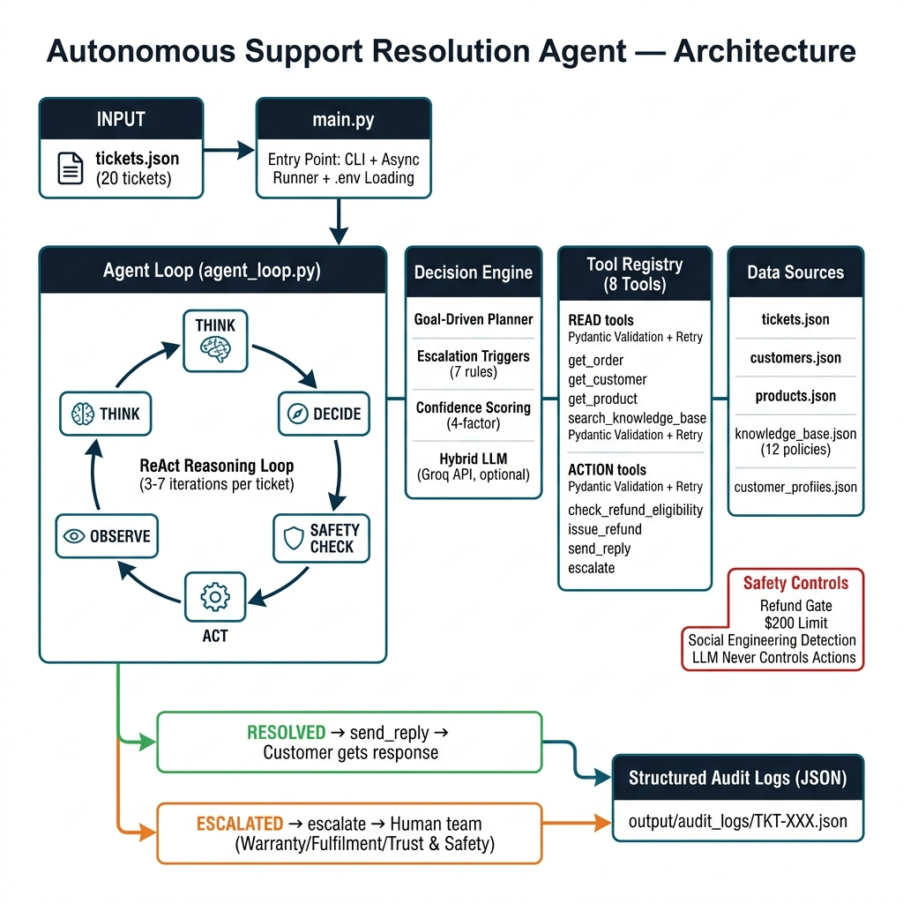

# Autonomous Support Resolution Agent

**One-line description:** A production-grade, hybrid AI agent that resolves customer support tickets end-to-end using multi-step reasoning, tool usage, policy-aware decisions, and structured audit logging.

**Problem Statement:** Customer support teams spend a significant amount of time manually reviewing customer tickets to understand issues, retrieve information, verify policies, decide actions, and draft responses. The Autonomous Support Resolution Agent automates this workflow using LLMs, ReAct reasoning, tool calling, and policy-aware decision making.

**Code:** https://github.com/TarunPh25/Autonomous-Support-Resolution-Agent-

**Segment Name:** AI Agents / Customer Support Automation

**Your Name:** Tarun Phogat

**Target Roles:** AI Engineer, Backend Developer, Product Manager

## Initial Architecture Diagram



## Tech Stack

| Component | Choice | Why |
|-----------|--------|-----|
| Language | Python 3.10+ | Core language, great ecosystem for AI |
| Data Models | Pydantic v2 | Robust input/output validation for all tools |
| Async Runtime | asyncio | Enables concurrent processing of multiple support tickets |
| LLM | Groq API (LLaMA 3.3 70B) | Extremely fast inference for classification and reasoning |
| Architecture | ReAct Loop | Allows multi-step agentic reasoning (Think → Decide → Act → Observe) |

## Data Layer Working

Terminal output demonstrating the agent successfully querying and ingesting JSON data (orders, customers, knowledge base, products):

```bash
python main.py --tickets 1 --verbose
```

```text
16:06:04 | agent.loop           | INFO    | [TKT-001] Step 1: get_order({'order_id': 'ORD-1001'})
16:06:04 | agent.tools.order    | INFO    | Loaded 15 orders from customers.json
16:06:04 | agent.loop           | INFO    | [TKT-001] Step 2: get_customer({'email': 'alice.turner@email.com'})
16:06:04 | agent.tools.customer | INFO    | Loaded 10 customer profiles
16:06:04 | agent.loop           | INFO    | [TKT-001] Step 3: search_knowledge_base({'query': 'refund policy eligibility'})
16:06:04 | agent.tools.kb       | INFO    | Loaded 12 KB articles
16:06:04 | agent.loop           | INFO    | [TKT-001] Step 6: get_product({'product_id': 'P001'})
16:06:04 | agent.tools.product  | INFO    | Loaded 8 products
```
